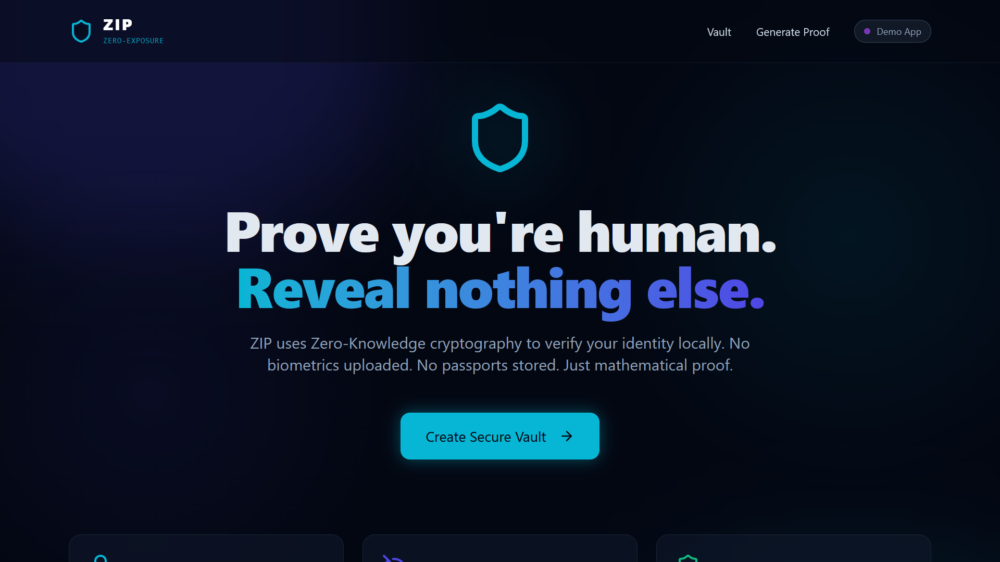
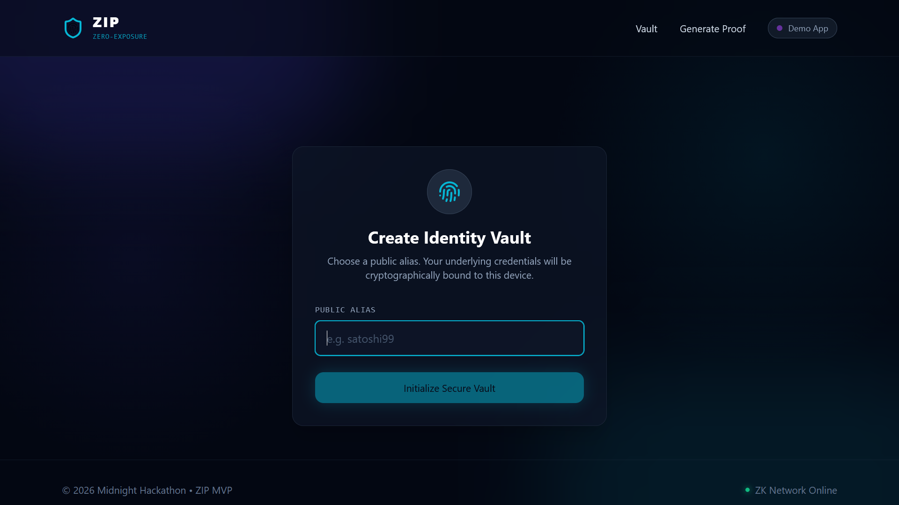
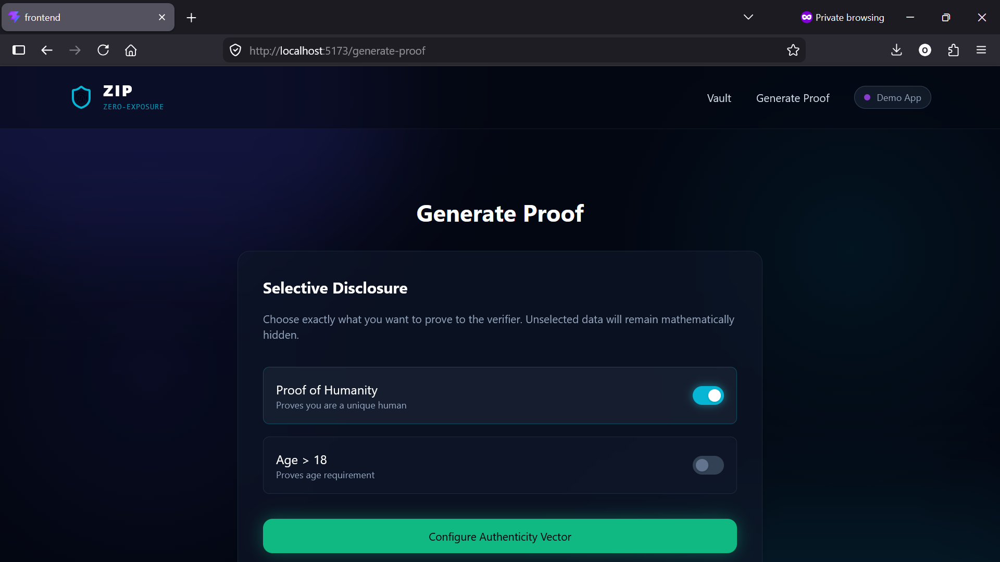
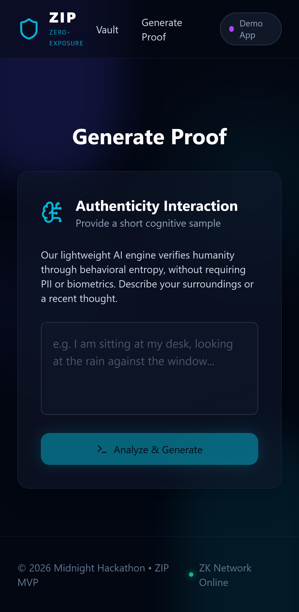
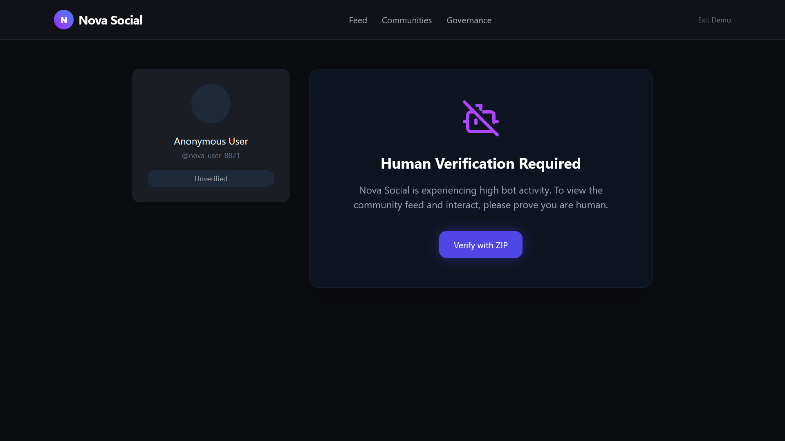
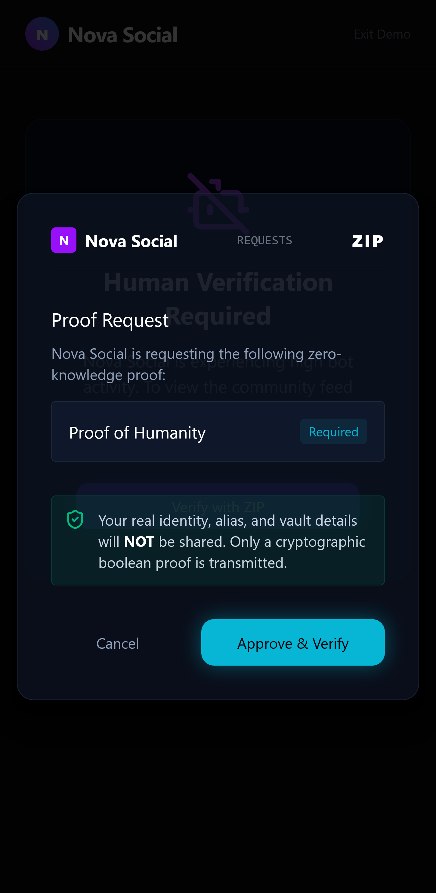

<div align="center">

<br/>

# 🔒 ZIP — Zero-Exposure Identity Proof

### *"Prove you're human. Reveal nothing else."*

<br/>

[](https://react.dev/)
[](https://www.typescriptlang.org/)
[](https://vitejs.dev/)
[](https://tailwindcss.com/)
[](https://midnight.network/)
[](LICENSE)

<br/>

> Built for the **Midnight MLH Hackathon 2026** — AI Track 🚀

</div>

<br/>

<div align="center">
  
</div>

<br/>

---

## 📖 Overview

**ZIP** is a **privacy-first Proof-of-Humanity** application that solves one of the most critical challenges in the modern internet: *How can you prove you are a real human without revealing who you are?*

Traditional identity systems force users to hand over passports, biometrics, or personal details just to access services. ZIP flips this model entirely. Using the principles of **Zero-Knowledge (ZK) cryptography**, users can generate a cryptographic proof of their humanity and present it to any application — without ever exposing the underlying data.

ZIP is purpose-built for the **Midnight Network**, a privacy-preserving blockchain layer that makes zero-knowledge proofs first-class citizens. This project demonstrates how privacy and utility can coexist in a seamless, elegant user experience.

---

## ✨ Key Features

| Feature | Description |
|---|---|
| 🔐 **Local Identity Vault** | All credentials are encrypted and stored locally — nothing ever leaves your browser |
| 🧮 **ZK-SNARK Proof Generation** | Simulates the full cryptographic pipeline of compiling a ZK circuit and synthesizing a proof |
| 🤝 **Nova Social Integration** | Demonstrates a real-world use case: proving humanity to a bot-plagued social platform |
| 🛡️ **AI Threat Guard** | Client-side anomaly detection that monitors proof request velocity to prevent bot abuse |
| 🌑 **Obsidian Dark UI** | Premium glassmorphism aesthetics with neon accents and fluid Framer Motion animations |
| ⚡ **Privacy-by-Default** | No backend, no database, no telemetry — zero exposure by design |

---

## 🌟 The MVP Experience

The MVP delivers three polished, emotionally resonant flows:

### 1. 🏛️ User Onboarding — *Local Vault*

<div align="center">
  
</div>

Users create a secure local identity vault using a **public alias** of their choosing.
- Raw credentials **never leave the browser**
- A local ZK key is derived and encrypted exclusively in the device's secure storage
- *Visualizes: Privacy-first design and local-only data retention*

### 2. 🧮 Generate Human Proof — *Selective Disclosure*

<div align="center">
  
  
</div>

Users can selectively disclose specific attestations (e.g., "Proof of Humanity") while keeping everything else private.

- Simulates compiling a ZK circuit
- Synthesizes a ZK-SNARK proof in real time with visual feedback
- *Visualizes: Mathematical proof generation without exposing underlying data*

### 3. 🌐 Connect to Nova Social — *Zero-Knowledge Handshake*

<div align="center">
  
  
</div>

"Nova Social" is a mocked, futuristic community platform under siege from bot attacks. Users authenticate with their ZIP proof via a secure handshake.

- The platform receives **only a cryptographic proof** — never the user's real identity
- Verification is instant and mathematically sound
- *Visualizes: An external app definitively verifying humanity without learning who you are*

---

## 🧠 Privacy Architecture

ZIP is designed around one core principle: prove humanity without exposing identity.

```txt
─────────────────────────────────────────────────────────────
                         👤 USER                             
                                                             
     Creates a secure identity vault using a public alias    
                                                             
        🔒 Raw identity data NEVER leaves device             
─────────────────────────────────────────────────────────────
                              │
                              ▼
─────────────────────────────────────────────────────────────
                  🔐 ZIP LOCAL IDENTITY VAULT                
                                                             
  • Encrypted browser storage                               
  • Local proof key generation                              
  • Selective disclosure controls                           
  • Privacy-first credential management                     
                                                             
        "Proofs are shared. Data stays private."            
─────────────────────────────────────────────────────────────
                              │
                              ▼
─────────────────────────────────────────────────────────────
                 🧮 HUMAN PROOF GENERATION                   
                                                             
  ZIP generates a privacy-preserving proof confirming:      
                                                             
     ✅ Verified Human                                       
     ✅ Unique User                                          
     ✅ Minimal Disclosure                                   
                                                             
  WITHOUT exposing:                                          
                                                             
     ❌ Passport                                              
     ❌ Biometrics                                            
     ❌ Face Scans                                            
     ❌ Legal Identity                                        
                                                             
        Simulated ZK proof + confidential computation        
─────────────────────────────────────────────────────────────
                              │
                              ▼
─────────────────────────────────────────────────────────────
             🌑 MIDNIGHT CONFIDENTIAL LAYER                  
                                                             
  • Privacy-preserving verification                         
  • Confidential state management                           
  • Selective disclosure architecture                       
  • Zero unnecessary data exposure                          
                                                             
       Only cryptographic proof data is transmitted         
─────────────────────────────────────────────────────────────
                              │
                              ▼
─────────────────────────────────────────────────────────────
                  🌐 NOVA SOCIAL (DEMO APP)                  
                                                             
  Receives ONLY:                                             
                                                             
       { verifiedHuman: true }                              
                                                             
  NEVER receives:                                            
                                                             
     ❌ Name                                                  
     ❌ Passport                                              
     ❌ Biometrics                                            
     ❌ Sensitive credentials                                 
                                                             
      ✅ Humanity verified WITHOUT surveillance              
─────────────────────────────────────────────────────────────
```

## 🏗️ Architecture & Tech Stack

ZIP prioritizes a polished, demo-ready experience. Application logic runs entirely in the browser, with the architecture designed to slot in real Midnight smart contract calls when ready.

### 🖥️ Frontend (`/frontend`)

| Technology | Purpose |
|---|---|
| **React 19** | Component-driven UI architecture |
| **TypeScript** | End-to-end type safety |
| **Vite** | Ultra-fast build tooling & HMR |
| **TailwindCSS v4** | Premium "Obsidian Dark" theme, glassmorphism, neon accents |
| **Framer Motion** | Fluid animations simulating cryptographic latency |

### 🔗 Midnight Network Infrastructure

| Component | Description |
|---|---|
| **Compact Smart Contracts** | `contracts/` contains `HumanityProof.compact` and `hello-world.compact` |
| **Midnight JS SDK** | Full suite of `@midnight-ntwrk/*` packages for ledger, wallet, ZK, and indexer |
| **Proof Server** | Docker-based ZK proof generation server (`docker compose up -d`) |
| **ZK Crypto Service** | `frontend/src/services/zipCryptoService.ts` — simulated locally for MVP speed |

### 🤖 AI Integration

| Component | Description |
|---|---|
| **Google Gemini** | `@google/genai` powers the AI Threat Guard anomaly detection layer |

### 🗺️ Repository Structure

```
zip-midnight-mlh-202605-hack/
├── 📁 contracts/             # Compact smart contracts (HumanityProof, hello-world)
│   └── 📁 managed/           # Compiled contract artifacts
├── 📁 frontend/              # React + Vite application
│   ├── 📁 src/
│   │   ├── 📁 components/    # UI components
│   │   ├── 📁 services/      # zipCryptoService (ZK simulation)
│   │   └── 📁 pages/         # Application flows
│   └── vite.config.ts
├── 📁 scripts/               # E2E check scripts
├── 📁 src/                   # Midnight backend (deploy, setup, CLI)
├── docker-compose.yml        # Proof server container
├── package.json
└── README.md
```

---

## 🚀 Getting Started

### Prerequisites

- **Node.js** `>= 22.0.0`
- **npm** (bundled with Node.js)
- **Docker** (optional — for the real ZK proof server)

### ⚡ Quick Start (Frontend MVP)

```bash
# 1. Clone the repository
git clone https://github.com/oluwatobiss/zip-midnight-mlh-202605-hack.git
cd zip-midnight-mlh-202605-hack

# 2. Navigate to the frontend
cd frontend

# 3. Install dependencies
npm install

# 4. Start the development server
npm run dev
```

Open your browser at **[http://localhost:5173](http://localhost:5173)** and experience ZIP! 🎉

### 🐳 Running the ZK Proof Server (Optional)

For full Midnight Network integration with a live proof server:

```bash
# From the root directory
npm run proof-server:start   # Starts the Docker proof server

# When done
npm run proof-server:stop
```

### 🔨 Compiling Smart Contracts (Optional)

```bash
# Compile both Compact contracts
npm run compile
```

---

## 🛡️ ZIP Threat Guard (AI Feature)

The **Threat Guard** is a lightweight AI-powered security layer built into the ZIP Dashboard.

- Monitors **proof request velocity** in real time
- Flags anomalous patterns that resemble bot behavior (e.g., rapid repeated proof generation)
- Runs **entirely client-side** — no raw identity data is ever inspected or transmitted
- Powered by **Google Gemini** for intelligent anomaly scoring

This demonstrates how AI and ZK cryptography can be combined to create security systems that are both intelligent and privacy-preserving.

---

## 🔮 Future Roadmap

- [ ] **Live Midnight Testnet Deployment** — Swap `zipCryptoService` simulation for the real Compact SDK
- [ ] **Lace Wallet Integration** — Native Midnight wallet connectivity
- [ ] **Multi-Attestation Support** — Age proofs, credential proofs, KYC-free verification
- [ ] **Cross-App Proof Portability** — One proof, usable across any Midnight-connected dApp
- [ ] **Decentralized Proof Registry** — On-chain proof revocation and validity checks

---

## 🤝 Contributing

Contributions, ideas, and feedback are welcome! Feel free to open an issue or submit a pull request.

1. Fork the repository
2. Create your feature branch: `git checkout -b feature/amazing-feature`
3. Commit your changes: `git commit -m 'Add amazing feature'`
4. Push to the branch: `git push origin feature/amazing-feature`
5. Open a Pull Request

---

## 👥 Contributors

<table>
  <tr>
    <td align="center">
      <a href="https://github.com/oluwatobiss">
        <br/>
        <sub><b>Oluwatobi Sofela</b></sub>
      </a>
    </td>
    <td align="center">
      <a href="https://github.com/GPramodh07">
        <br/>
        <sub><b>G Pramodh</b></sub>
      </a>
    </td>
    <td align="center">
      <a href="https://github.com/ShazilParwez">
        <br/>
        <sub><b>Shazil Parwez</b></sub>
      </a>
    </td>
  </tr>
</table>

---

## 📄 License

This project is licensed under the **MIT License** — see the [LICENSE](LICENSE) file for details.

---

<div align="center">

*Built with ❤️ for the **Midnight MLH Hackathon 2026***

**Prove you're human. Reveal nothing else. 🔒**

</div>
